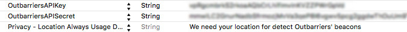

# outbarriers-sdk-ios-sample
Sample of usage of Outbarriers SDK for iOS.

> ##### **NOTE**:
> You need the **API KEY** and **API SECRET** of Outbarriers API. If you want 
> develop an app or integrate Outbarriers SDK with your app, send us an email 
> indicating what do you want to do and we'll study your proposal and we'll
> send you the credentials if applicable

## Steps to run sample

1. Clone this repository

    ```bash
    git clone https://github.com/digitalilusion/outbarriers-sdk-ios-sample.git
    ```
2. Open `Info.plist` to add your Outbarriers API credentials (`OutbarriersAPIKey` and `OutbarriersAPISecret`). Add `NSLocationAlwaysUsageDescription` to allow Location Services to detect Outbarriers' Beacons.



3. _It's done!_ Now you can test it :)

